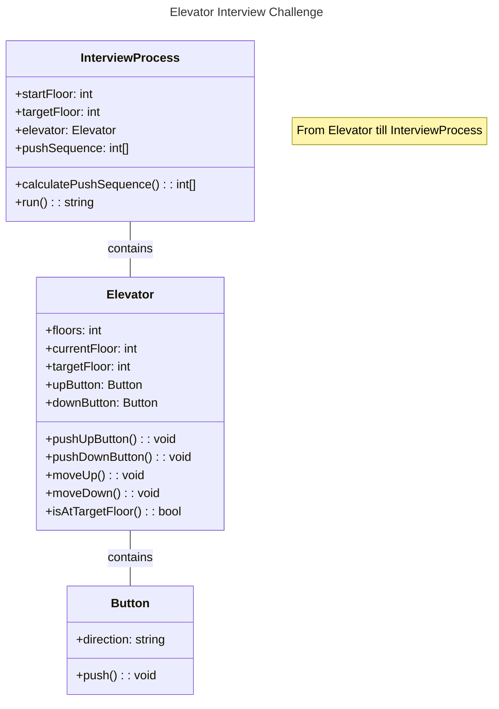

# Elevator Interview Challenge - Gherkin


* [Descrição](#descrição)
* [Problema](#problema)
* [Entrada](#entrada)
* [Saída](#saída)
* [Gherkin](#gherkin)
* [Diagrama de Classe (com Mermaid)](#Diagrama-de-Classe-(UML))
* [Alunos](#alunos)


## Descrição

Este repositório contém um diagrama da UML e uma especificação de requisito funcional em Gherkin do problema do Elevador.

## Problema

Você está a caminho de sua primeira entrevista de emprego como testador de programa e já está atrasado. A entrevista é em um arranha-céu e você está no andar s, onde vê um elevador. Ao entrar no elevador, você aprende que ele possui apenas dois botões, marcados “UP u” e “DOWN d”. Você conclui que o botão UP leva o elevador u andares para cima, enquanto o botão DOWN leva você d andares para baixo. Sabendo que a entrevista é no andar g e que há apenas f andares no prédio, você rapidamente decide escrever um programa que fornece a quantidade de apertos de botão que você precisa.

## Entrada

A entrada consistirá em uma linha no formato "f s g u d", onde:
- f: número total de andares no prédio (1 ≤ f ≤ 1000000)
- s: andar onde você está (1 ≤ s ≤ f)
- g: andar onde é a entrevista (1 ≤ g ≤ f)
- u: número de andares que o botão UP leva (0 ≤ u ≤ 1000000)
- d: número de andares que o botão DOWN leva (0 ≤ d ≤ 1000000)

## Saída

A saída deve ser o número mínimo de empurrões que você deve fazer para chegar do andar s ao andar g, ou a mensagem "use the stairs" se for impossível chegar ao andar g usando o elevador fornecido.


## Gherkin

```gherkin
@system
Feature: bee3250 CLI


Narrative:

In order to avoid silly mistakes
As a job interview candidate for a tester position
I want to calculate the minimum button presses in an elevator

Scenario: Run program with input parameters f = 10, s = 2, g = 9, u = 3, d = 1

Given the building has a total of f floors
And I am currently on floor
And the goal floor is g
And the elevator can go u floors up and d floors down
"""
10 2 9 3 1
"""
When program runs
Then output should be
"""
4
"""

Scenario: Run program with input parameters f = 20, s = 5, g = 15, u = 2, d = 3

Given the building has a total of f floors
And I am currently on floor
And the goal floor is g
And the elevator can go u floors up and d floors down
"""
20  5   15  2   3  
"""
When program runs
Then output should be
"""
7
"""

Scenario: Run program with input parameters f = 7, s = 1, g = 7, u = 2, d = 1

Given the building has a total of f floors
And I am currently on floor
And the goal floor is g
And the elevator can go u floors up and d floors down
"""
7 1 7 2 1
"""
When program runs
Then output should be
"""
3
"""

Scenario: Run program with input parameters f = 8, s = 3, g = 10, u = 1, d = 2

Given the building has a total of f floors
And I am currently on floor
And the goal floor is g
And the elevator can go u floors up and d floors down
"""
8 3 10 1 2
"""
When program runs
Then output should be
"""
use the stairs
"""

Scenario: Run program with input parameters f = 5, s = 5, g = 2, u = 1, d = 1

Given the building has a total of f floors
And I am currently on floor
And the goal floor is g
And the elevator can go u floors up and d floors down
"""
5 5 2 1 1
"""
When program runs
Then output should be
"""
use the stairs
"""

```
## Diagrama de Classe (UML)



# Alunos
- Luiz Eduardo Mello dos Reis
- Lucas Bankow
